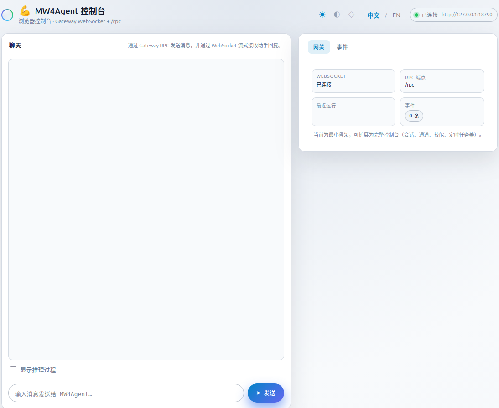

# MW4Agent

Python 实现的智能体网关与 CLI，设计上参考 [OpenClaw](https://github.com/openclaw/openclaw) 的网关模型、RPC 语义与可扩展命令体系，提供 Gateway、Agent 运行、多通道接入与 Web 控制台等能力。

## 功能概览

- **Gateway**：HTTP RPC（`agent` / `agent.wait` / `health`）与 WebSocket 事件流（`/ws`），支持幂等、run 注册与等待
- **Agent Runner**：基于 LLM 的对话与工具调用循环，支持 reasoning/thinking 流式输出、内置 read/write 工具（workspace 限定）
- **CLI**：可扩展命令注册与懒加载，提供 `gateway`、`agent`、`channels`、`config`、`configuration` 等命令组
- **Desktop（Orbit）**：Next.js + Tauri 桌面 / 独立 Web 前端，经 RPC 与 WebSocket 连接 Gateway；用法见 [mw4agent/desktop/README.md](mw4agent/desktop/README.md)
- **Dashboard**：浏览器控制台，连接 Gateway WebSocket，支持聊天、事件流展示与多语言/主题
- **Channels**：Console、Telegram、Webhook、飞书等通道，可独立运行或与 Gateway 配合
- **配置与安全**：加密配置文件、LLM provider/model 配置、技能（skills）管理

## 安装

```bash
git clone <repo-url>
cd mw4agent
pip install -e .
```

依赖：Python ≥ 3.8，参见 `setup.py` 中的 `install_requires`（如 click、fastapi、uvicorn、cryptography、httpx 等）。

**SOCKS 代理**：若 `HTTP_PROXY` / `HTTPS_PROXY` 为 `socks5://` / `socks://`，需额外安装 SOCKS 支持，否则 httpx 会报错缺少 `socksio`：

```bash
pip install -e ".[socks]"
# 或：pip install httpx[socks]
```

## 使用

安装后可通过命令行使用：

```bash
mw4agent --help
mw4agent gateway run --bind 127.0.0.1 --port 18790
mw4agent gateway status --url http://127.0.0.1:18790
```

### Desktop（Orbit）

独立桌面或本地 Web 界面（`npm run dev` / Tauri），与 Gateway 使用相同的 **HTTP RPC** 与 **WebSocket**；需先启动 Gateway，再按 **[Desktop 使用说明](mw4agent/desktop/README.md)** 安装依赖、配置 `NEXT_PUBLIC_GATEWAY_URL` 并运行。

### Dashboard 控制台

Dashboard 是内嵌在 Gateway 里的 Web 控制台，用于在浏览器里与 Agent 对话、查看连接状态与事件流。

1. **启动 Gateway**（会同时提供 Dashboard 静态页与 WebSocket）：

   ```bash
   mw4agent gateway run --bind 127.0.0.1 --port 18790
   ```

2. **打开浏览器**访问：

   - 根路径（会跳转到 Dashboard）：`http://127.0.0.1:18790/`
   - 或直接：`http://127.0.0.1:18790/dashboard/`

3. **界面说明**：
   - **左侧**：聊天区域，输入消息后通过 Gateway RPC 触发 Agent，回复经 WebSocket 流式展示；可勾选「显示推理过程」查看 reasoning 块。
   - **右侧**：两个标签——**Gateway** 显示 WebSocket 连接状态、RPC 端点、最近 runId、事件总数；**事件** 分条展示当前收到的 WebSocket 事件（lifecycle / tool / assistant）。
   - **顶部**：主题切换（浅色 / 柔和暗色 / 深色）、中英文切换、连接状态。

若在本地已启动 Gateway，将浏览器指向上述地址即可使用。界面示意如下：



**完整用法与示例**（包括 gateway、agent、channels、config、configuration 等）请参见：

- **[CLI 使用手册](docs/manuals/cli.md)**

## 架构特点

- **CLI 可扩展**：类似 OpenClaw 的 command-registry，命令按需懒加载，便于扩展新命令组
- **Gateway 中心化**：统一提供 RPC 与 WebSocket，Agent 事件（lifecycle / assistant / tool）经 Gateway 广播，便于多端消费
- **Agent 与事件流**：`AgentRunner` 内部事件流与 Gateway 桥接，runId 贯穿全链路，支持 `agent.wait` 等待终态
- **工具与权限**：内置 read/write 工具限定在 `workspace_dir` 下；工具支持 `owner_only` 标记（可扩展为按身份过滤）
- **多后端 LLM**：支持 echo、OpenAI 兼容、OpenRouter 等，配置驱动；可选 reasoning/thinking 级别与推理块展示

更多架构与设计文档见 `docs/architecture/` 与 `docs/openclaw/`。

## 项目结构（简要）

```
mw4agent/
├── mw4agent/
│   ├── cli/              # CLI 入口与命令注册
│   ├── gateway/          # Gateway HTTP/WS 服务与状态
│   ├── agents/            # AgentRunner、tools、events、reasoning
│   ├── llm/               # LLM 调用与多后端
│   ├── dashboard/         # 前端静态资源（index.html、app.js 等）
│   ├── channels/         # console、telegram、webhook、feishu
│   └── ...
├── docs/
│   ├── manuals/cli.md     # CLI 使用手册（推荐入口）
│   ├── architecture/     # 架构与设计文档
│   └── openclaw/         # 与 OpenClaw 的对照与说明
├── plugins/              # 可选插件（如 feishu_docs：飞书云文档 MCP）
├── setup.py
└── README.md
```

## License

见仓库根目录 LICENSE 文件。
